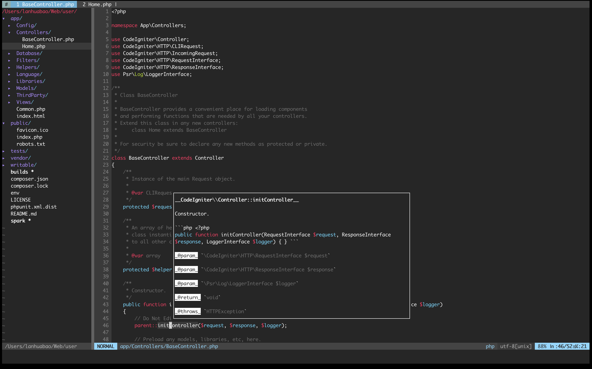
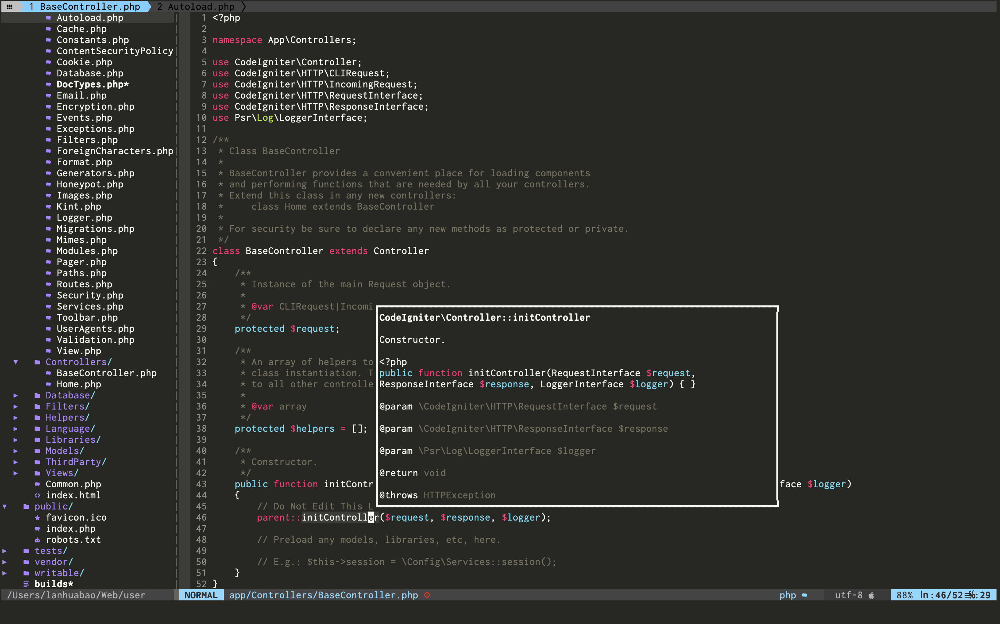

## vimrc  

- 预览图

  终端模式

  

gvim/macvim




- 将 .vimrc .vim/ 移动到用户根目录

  ```
  mv .vimrc .vim/ ~
  mkdir ~/.vim.swcache
  ```

- 安装依赖

  ```shell
  npm i intelephense -g
  brew install font-inconsolata-nerd-font
  brew install macvim 
  ```
  
- 安装插件

  ```
  #在vim中执行
  :PlugInstall
  ```

- 额外配置

  .vimrc 197行为启动vim自动打开的目录,当前为 ~/

  

- 快捷键(参考 .vimrc)
```
-   窗口快速选择（按住-后 根据q-w-e等快速选择窗口）
==  全屏（仅支持gvim/macvim）
=-  非全屏（仅支持gvim/macvim）
ss  全局快速搜索文件
ssb 搜索已打开的文件
ssm 搜索最近编辑的文件
F1  显示浮动终端（终端状态下按住F1隐藏终端）
F2  杀死终端
fc  快捷切会文件浏览器
ff  快速在文件浏览器中定位文件
le  显示当前文件代码错误信息
ld  快速跳转到光标位置的方法定义的位置
lr  查看当前光标位置的方法/变量在何处被引用
```

- 更多编程语言支持

  https://github.com/prabirshrestha/vim-lsp/wiki/Servers-Go  

